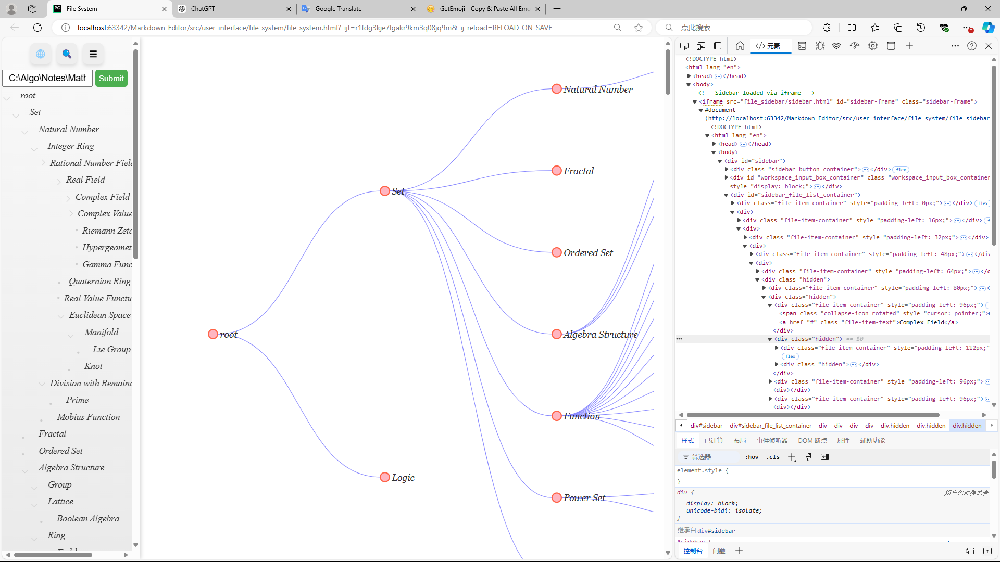

# Markdown Editor

[TOC]



## Markdown File System

### Basic operation for markdown file

The system supports the core operations of a file lifecycle, often summarized as CRUD:

- **Create**: Add a new file to the system.
- **Read**: View the contents of a file.
- **Update**: Edit and modify file contents.
  - **Rename**
- **Delete**: Permanently remove a file from the system.
- **Move**: Move markdown file with its assets from original path to the new path.


Right-clicking on a file in the file sidebar opens a context menu with these operations. If you read the markdown file, the system will run the Typora to help you edit the markdown file.

```
curl --location 'http://localhost:5000/markdown_editor/function' \
--header 'Content-Type: application/json' \
--data '{
    "function": "move_md_file",
    "params": {
        "original_md_path": "C:\\Algo\\Research\\Go\\docs\\go\\Go.md",
        "new_folder_path": "C:\\Algo\\Research\\Go\\docs\\"
    }
}'
```

### Draw the graph form markdown files

The system supports drawing a visual file graph to provide a comprehensive overview of file relationships and structures. This feature is particularly useful for understanding dependencies and hierarchy within a project. You can see it in detail on [Note Graph](./docs/Note_Graph.md).

### List the file tree

Once the workspace path is specified, the system will display the file tree in the sidebar. We support the Expand/collapse icon for file subtrees, enabling efficient navigation.

### Keyword Search in markdown files

Users can search for specific content across files by entering a keyword or using regular expressions for more complex queries. We will return matching lines and corresponding file names and the matching keywords are highlighted.

### Manage the assets of markdown files

We can manage all assets which linked to the markdown notes including rename, crud, change the path.


- **Rename**
- **Move**
- **Delete unused assets**

## Markdown Compiler

### Parse the Markdown files

We use run the Typora to editor the markdown files. 

## Markdown Editor


### SVG Editing

We use run the Draw.io to editor the SVG files. 

### Table Editing

We create a Table Editor to editor the tables in markdown files. 

