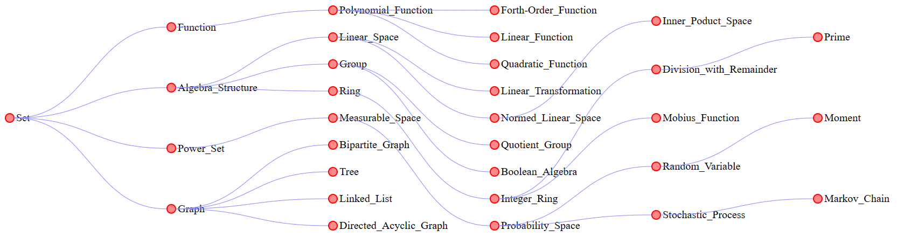
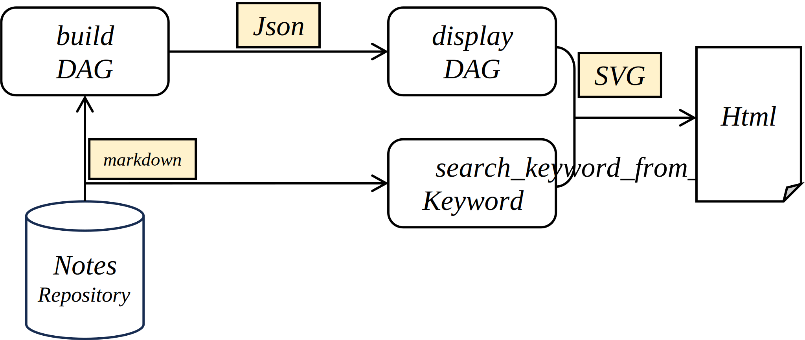

# Note Graph

[TOC]

## Concept

### Node Definition

- **Key**: A unique identifier for the note, typically its file path.
- **Content**: The complete text of the note.
- **Kids**: all notes hyperlinked within the current note.
- **Parents**:  all notes which link to this noteor are referenced in the "Define" section of the current note.
- **Coordinate**: the note's depth and traversal order in the directed acyclic graph (DAG) during a depth-first search (DFS).

### Note Graph

- All notes together form a directed acyclic graph.

## System

### Analysis markdown file

**Input**: A Markdown file path.
**Output**: Updates the note list to reflect the relationships between notes.

First, we choose the file path as the note's unique identifier. If the note is not already in the map, create a new node object for it and initialize attributes. Then, use a regular expression to extract all Markdown links and identify and parse the "Define" section. And update the note's parent and kid attribute.

### Analysis repository to build DAG

**Input**: A directory path containing Markdown files.

**Output**: A JSON file representing the knowledge graph, which format by a map $key \to \text{value of node}$.

First, recursively traverse the directory to identify all Markdown files and parse the Markdown file to reconstruct the graph. Next, identify root nodes using the `findRoots` function (nodes with no parents). And use the `bfs` function to and Calculate the `level` (depth) and `index` (horizontal position) of each node. Finally, Serialize the map into a JSON-compatible format and write the serialized graph to a file for further processing.

### Draw the note DAG

We create an SVG to render the input Note Graph. Each note is represented as a circle, displaying its coordinates and file name, with a hyperlink to its file address. Clicking on a node redraws the graph with that node as the root. Edges connecting parent and child nodes are drawn using Bezier curves for a smooth and elegant appearance.
